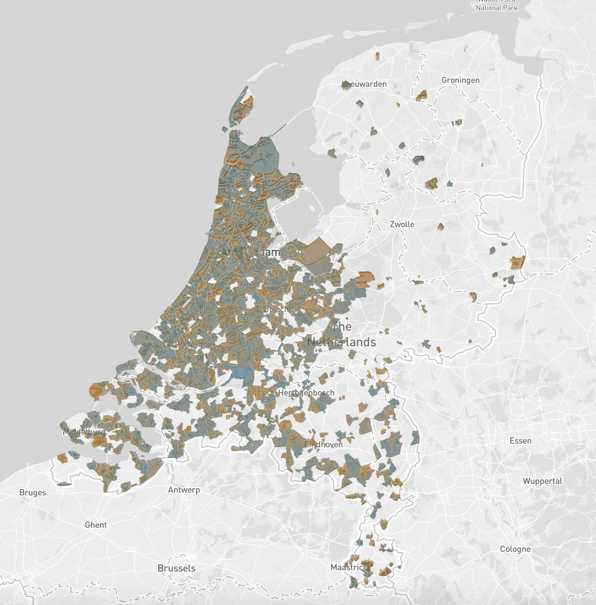

# Funda pricemap

Live on GitHub pages: [https://coens97.github.io/funda-pricemap/](https://coens97.github.io/funda-pricemap/).
 
The following project consist of 2 parts, a scraper and a viewer. First the scraper will gather all the houses from Funda, calculate the average price per square meter per postal code. The results will be put in the GitHub pages folder /docs/. Inside that folder is also the build of the viewer of the data.

## Stack
 - Scraper
    - Clojure: A Lisp programming language that runs on the JVM
    - Apache Spark: Data processing platform
 - Viewer
    - React: Presentation library
    - Mapbox mapservice